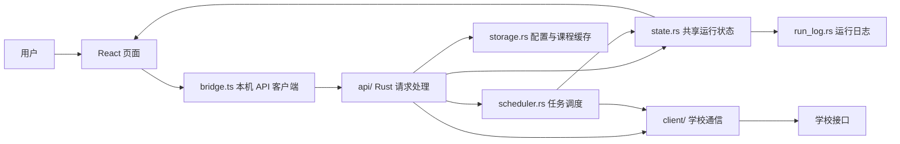
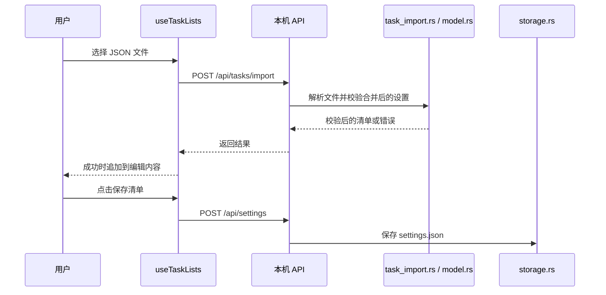

# 代码结构与执行流程

本文说明当前 Rust 版本的文件职责和主要调用关系。使用方法见 [README](../README.md)，修改约定见 [维护指南](architecture.md)，学校接口的原 Go 实现对照与已知问题见 [Protocol Review](protocol-review.md)。

## 整体结构

程序由 React 界面和 Rust 本地服务组成。正式构建会把前端静态文件嵌入 Rust 可执行文件，启动后通过系统浏览器访问本地服务。浏览器负责显示和编辑；学校会话、课程下载、任务执行和文件保存都在 Rust 中完成。



图中状态返回界面的箭头通过 HTTP 轮询实现，没有 WebSocket 推送。关闭浏览器标签页不会关闭 Rust 服务；关闭服务会结束任务，运行状态没有断点恢复。

## 目录地图

```text
src/
  main.tsx                React 挂载入口
  App.tsx                 共享状态、页面和弹窗组装
  ActivityLog.tsx          运行记录页面
  pages/                  课程、任务、设置页面
  components/             弹窗与通用界面组件
  hooks/                  有状态的前端操作流程
  domain/                 不依赖 React 和网络的辅助函数
  bridge.ts               本机 HTTP API 封装
  types.ts                前后端交换的 TypeScript 类型
  navigation.ts           页面与主题类型
  styles.css              界面样式
  App.test.tsx             页面交互测试
  domain.test.ts           辅助函数测试
server/
  build.rs                嵌入前端资源的构建准备
  Cargo.toml              Rust 包与依赖声明
  src/
    main.rs               程序入口和端口解析
    lib.rs                服务初始化与关闭
    api/                  本机 HTTP 路由
    client/               学校 HTTP 通信
    scheduler.rs          任务顺序、查询并发与停止
    state.rs              共享状态与事件发布
    model.rs              数据模型、课程解析和规则校验
    task_import.rs        任务清单交换文件解析
    storage.rs            配置文件、缓存、数据目录迁移
    run_log.rs            按运行批次保存和读取日志
examples/                   可编辑的任务清单 JSON 示例
.github/workflows/          自动检查、六平台构建与发布
```

`node_modules/`、`dist/` 和 `server/target/` 分别是前端依赖、前端构建产物和 Rust 构建缓存，不是业务源码。运行时的 `data/` 也不应提交到 Git。

## 前端：从操作到请求

React 的组件负责描述界面；以 `use` 开头的 hook 在这里负责保存状态、处理操作和安排轮询。TypeScript 类型帮助编译器检查代码，不会自动验证用户导入的 JSON。

| 文件或目录                                              | 当前职责                                                                                  |
| ------------------------------------------------------- | ----------------------------------------------------------------------------------------- |
| [App.tsx](../src/App.tsx)                               | 连接各 hook、页面与弹窗，仍持有课程搜索、筛选、分页等界面状态；开始任务成功后切到运行记录 |
| [pages/CoursesPage.tsx](../src/pages/CoursesPage.tsx)   | 课程资料获取、导入入口、搜索和教学班列表                                                  |
| [pages/TasksPage.tsx](../src/pages/TasksPage.tsx)       | 清单选择、任务编辑、JSON 导入导出与启动入口                                               |
| [pages/SettingsPage.tsx](../src/pages/SettingsPage.tsx) | 学期、执行参数、外观和 User-Agent 设置                                                    |
| [ActivityLog.tsx](../src/ActivityLog.tsx)               | 运行批次选择、日志轮询和历史分页                                                          |
| [components/](../src/components/)                       | 登录、课程详情、退课选择、任务确认弹窗，以及页面说明和基础组件                            |
| [hooks/useWorkspace.ts](../src/hooks/useWorkspace.ts)   | 初始配置与课程加载、凭据和 UA 状态、运行快照轮询                                          |
| [hooks/useLogin.ts](../src/hooks/useLogin.ts)           | 登录表单、账号登录、二维码获取和状态轮询                                                  |
| [hooks/useTaskLists.ts](../src/hooks/useTaskLists.ts)   | 清单与任务增删改、退课配对、导入追加与当前清单导出                                        |
| [hooks/useTheme.ts](../src/hooks/useTheme.ts)           | 主题保存及页面外观同步                                                                    |
| [domain/](../src/domain/)                               | 课程筛选、凭据映射、时间单位、进度标签、默认设置和 UA 生成辅助                            |
| [bridge.ts](../src/bridge.ts)                           | 统一发起本地 HTTP 请求并处理 JSON 响应                                                    |

页面不直接请求学校网站。追踪一个按钮时，先看页面收到的回调，再找 `App.tsx` 或 hook 的实现，最后沿着 `bridge.ts` 的 API 路径进入 Rust。

## Rust：本机 API、任务调度与学校通信

Rust 的 `mod` 声明模块；目录中的 `mod.rs` 是该模块的入口。`impl SchoolClient` 可以分布在多个文件中，它们为同一个学校客户端实现不同方法，并不各自创建一套独立会话。

| 文件或目录                                                                                     | 当前职责                                                                   |
| ---------------------------------------------------------------------------------------------- | -------------------------------------------------------------------------- |
| [main.rs](../server/src/main.rs)、[lib.rs](../server/src/lib.rs)                               | 解析端口，初始化数据和状态，启动 HTTP 服务、自动登录与浏览器，处理关闭信号 |
| [api/mod.rs](../server/src/api/mod.rs)                                                         | 注册全部本机路由，定义业务错误到 HTTP 响应的转换                           |
| [api/settings.rs](../server/src/api/settings.rs)                                               | 设置、凭据和 UA 的读取与保存                                               |
| [api/auth.rs](../server/src/api/auth.rs)                                                       | 登录、退出和扫码流程的本机请求入口                                         |
| [api/courses.rs](../server/src/api/courses.rs)                                                 | 缓存读取、课程导入、学校课程下载及其进度                                   |
| [api/tasks.rs](../server/src/api/tasks.rs)                                                     | 导入清单、启动任务、发出停止请求                                           |
| [api/activity.rs](../server/src/api/activity.rs)                                               | 当前状态、运行批次和日志分页查询                                           |
| [api/assets.rs](../server/src/api/assets.rs)                                                   | 提供嵌入程序的静态界面资源                                                 |
| [client/mod.rs](../server/src/client/mod.rs)                                                   | `SchoolClient`、HTTP 会话与通用请求辅助                                    |
| [client/auth.rs](../server/src/client/auth.rs)                                                 | 学校登录、Cookie 会话、二维码及相关表单处理                                |
| [client/courses.rs](../server/src/client/courses.rs)                                           | 教务课程分页查询及完整性检查                                               |
| [client/enrollment.rs](../server/src/client/enrollment.rs)                                     | 余量查询、提交准备、选课和退课响应分类                                     |
| [client/ua.rs](../server/src/client/ua.rs)、[client/random.rs](../server/src/client/random.rs) | User-Agent 处理与查询等待时间的随机辅助                                    |
| [scheduler.rs](../server/src/scheduler.rs)                                                     | 单次和蹲课模式的执行顺序、重试条件、并发查询、停止处理                     |
| [state.rs](../server/src/state.rs)                                                             | 当前客户端、取消信号、下载进度、最近事件，以及事件写入日志                 |
| [model.rs](../server/src/model.rs)、[task_import.rs](../server/src/task_import.rs)             | 数据模型与校验；后者集中处理清单交换格式                                   |
| [storage.rs](../server/src/storage.rs)、[run_log.rs](../server/src/run_log.rs)                 | 配置和课程缓存持久化；运行日志创建、批次枚举和分页读取                     |

`AppState` 通过 `Arc<Mutex<...>>` 共享运行状态：多个异步任务可以持有同一状态，访问受互斥锁保护。学校网络请求前应释放锁。当前事件发布中的日志写入仍是同步操作，模块拆分没有消除这项性能约束。

## 主要执行流程

### 启动与显示

1. `main.rs` 优先解析 `HDU_PORT`，其次是第一个命令行参数，默认端口为 6688。
2. `lib.rs` 初始化数据目录和共享状态，尝试迁移旧目录中的配置，并启动本地服务及自动登录流程。
3. 浏览器加载静态界面，`main.tsx` 挂载 `App`；`useWorkspace` 读取设置、课程等数据，并定时获取 `/api/snapshot`。
4. 学校会话和任务运行在服务进程中，浏览器通过响应和后续轮询更新显示。

### 从教务获取课程

`CoursesPage` → `App` 的获取回调 → `bridge.ts` → `/api/courses/fetch` → `SchoolClient::courses` → 校验并规范化 → 保存 `courses.json` → 更新界面。

学校查询在 `client/courses.rs` 中每页请求 9999 条，并处理分页和总数。若学校没有返回总数，需要继续查询到空页；不能仅因某页不足 9999 条就认定下载完成。重复页、总数变化或提前空页会报错，避免用不完整资料覆盖缓存。HTTP 客户端支持 gzip，下载进度通过共享状态供前端轮询。

### 导入清单与保存



导入失败保留原编辑内容；导入成功也不会自动保存或启动任务。导出由浏览器生成当前清单的 JSON 文件，不导出登录凭据。格式字段、数量限制和示例见 [任务清单 JSON 格式](task-list-format.md)。

### 启动、执行与停止

1. 任务页打开 `TaskReviewDialog`，展示目标课和先退课程；用户确认后先保存设置，再调用 `/api/tasks/start`。
2. `api/tasks.rs` 校验任务并创建该批次的日志和取消信号，然后启动 `scheduler::run_tasks`。启动成功后，前端切到运行记录。
3. 单次模式按任务顺序执行；每个任务先处理指定退课，再提交目标课。蹲课模式分组并发查询余量，选退课提交仍串行进行。这里主要使用 Tokio 异步任务，不是每门课独占一个系统线程。
4. 学校响应在 `client/enrollment.rs` 中分为 `Success`、`Rejected`、`Unknown`。调度器发布含课程身份和选退课操作的事件，界面据此显示结果。
5. 停止按钮发送 `/api/tasks/stop`，请求取消后续工作。已经发出的选退课请求不能撤回，需要等待结果；直接退出服务不能保证等待在途提交结束。

先退后选不是事务：退课成功后选课失败不会自动恢复旧课。学校接口返回成功也不等于程序已独立查询已选课表核验。

### 日志与历史批次

`scheduler.rs` → `state::publish` → `run_log.rs` → `data/logs/<运行编号>.jsonl`。

每个文件首行为运行信息，后续各行是事件。内存只保留最近 1000 条事件，磁盘日志按批次保留。`ActivityLog` 通过 `/api/runs` 选择批次，再通过 `/api/runs/{id}` 获取日志页；加载更早记录时暂停自动刷新，避免挤掉正在阅读的历史内容。旧日志缺少操作类型时显示“操作未记录”，不会根据当前任务猜测。

## 数据模型与保存位置

| 模型         | 含义                                                                                     |
| ------------ | ---------------------------------------------------------------------------------------- |
| `Course`     | 一条教学班资料；`jxbmc` 为教学班编号，`jxb_id` 为教学班内部编号，`kch_id` 为课程内部编号 |
| `CourseTask` | 目标教学班及先退课程等任务设置                                                           |
| `TaskList`   | 有名称的一组任务                                                                         |
| `Settings`   | 学年学期、执行参数及全部任务清单                                                         |
| `Progress`   | 某一步的状态、说明，以及关联课程和操作类型                                               |
| `Snapshot`   | 当前会话、运行状态、最近事件、课程下载进度等界面所需状态                                 |
| `RunInfo`    | 一次运行的编号、清单名称及开始时间                                                       |

前端类型在 `src/types.ts`，Rust 模型主要在 `model.rs`，运行快照在 `state.rs`，日志批次结构在 `run_log.rs`。两端类型手工对应，修改交换字段时需要一起检查；服务器的解析和规则校验才是输入验证。

默认数据目录为可执行文件旁的 `data/`，可通过 `HDU_DATA_DIR` 覆盖。

| 保存位置            | 内容                   |
| ------------------- | ---------------------- |
| `settings.json`     | 已保存的清单与执行设置 |
| `courses.json`      | 课程资料缓存           |
| `credentials.json`  | 明文登录凭据           |
| `ua.json`           | User-Agent 设置        |
| `logs/*.jsonl`      | 各次运行的日志         |
| 浏览器 localStorage | 主题偏好               |

编辑中尚未保存的清单、学校会话与正在执行的任务状态不做断点恢复。配置写入目前也不是原子替换，不能把“保存在本地”理解为已经解决全部中断或并发保存问题。

## 构建与验证入口

开发时 `vite.config.ts` 将前端的 `/api` 请求代理到默认的本地服务端口。正式构建先执行 `npm run build` 生成 `dist/`，再由 Rust 构建嵌入这些资源；只编译 Rust 不能保证得到最新界面。`server/build.rs` 在缺少 `dist/` 时会创建占位页，因此不能用 Rust 编译成功替代前端构建检查。

```sh
npm run format:check
npm run build
npm test
npm run server:test
cargo clippy --locked --manifest-path server/Cargo.toml --lib -- -D warnings
```

`src/App.test.tsx` 用模拟 API 验证页面切换、导入、保存、导出和任务确认；`src/domain.test.ts` 检查辅助函数。Rust 测试分布在对应模块和 `client/tests.rs`，覆盖数据校验、协议响应、模拟课程分页、gzip 和日志读写。这些测试不使用真实学校凭据，也不等于完成真实选退课联调。

`.github/workflows/check.yml` 执行提交检查；`.github/workflows/release.yml` 在版本标签触发时为六个平台构建并打包，操作步骤见 [发布指南](releasing.md)。

## 建议阅读顺序

先用 `types.ts` 和 `model.rs` 认识数据，再读 `App.tsx` 与三个页面，随后沿一次“导入清单”操作读 `useTaskLists.ts`、`bridge.ts`、`api/tasks.rs` 和 `task_import.rs`。理解本机 API 后，再读 `scheduler.rs`、`client/enrollment.rs`、`state.rs` 和 `run_log.rs`，串起任务执行与结果记录。

修改学校协议前应另读 Protocol Review；修改界面布局通常只需页面和组件，不需要进入学校客户端。
