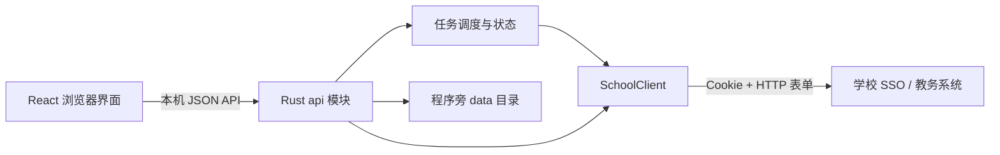

# Protocol Review：Rust 当前实现与 Go v1.4.9 源码对照

新项目为 **Rust 本地 HTTP 服务 + React 浏览器界面**，原项目为归档核对过的 Go v1.4.9 源码。本文记录两版的协议对应关系与业务差异。

**验证范围：源码对照与本地测试。** 已运行 Rust 单元测试、本地模拟 HTTP 测试及 React 交互测试，未使用真实学校会话，也未提交真实选退课。下文“相同”仅指对应字段或算法，不代表学校线上兼容性已验证。

当前 Rust/React 文件链接相对本文所在目录。Go 引用以原仓库内的文件路径与函数名保留，源码来源为 cr4n5/HDU-KillCourse；不再链接已经删除的本地归档。本次目录整理只调整引用，下面的静态对照仍针对删除前已审查的 Go v1.4.9 副本，不声称远程仓库当前内容相同。

本次重新核对的提交结果与调度逻辑来自 Go v1.4.9 的固定提交 [`31d7020`](https://github.com/cr4n5/HDU-KillCourse/tree/31d7020308b297583308c926389897f2132d8482)，涉及 `pkg/course/killCourse.go`、`pkg/course/waitCourse.go`、`client/service.go` 和 `client/resp.go`。其他协议章节没有因此重新做学校联调。

## 1. 阅读方式与源码入口

可以把学校接口理解为远程函数：URL 是函数地址，表单是参数，JSON/HTML 是返回值。浏览器调用的是本机 `/api/*`；真正给学校发送请求的是 Rust 的 `SchoolClient`。这两层接口不能混为一谈。

| 职责                 | Go 原版                                                | Rust / React 当前版                                                                                                                                |
| -------------------- | ------------------------------------------------------ | -------------------------------------------------------------------------------------------------------------------------------------------------- |
| HTTP、Cookie、请求头 | `client/client.go`：`NewClient/Get/Post/SaveCookies`   | [client/mod.rs](../server/src/client/mod.rs)：HTTP 客户端与请求辅助函数                                                                            |
| 学校端点与表单       | `client/service.go`、`client/req.go`、`client/resp.go` | [client/auth.rs](../server/src/client/auth.rs)、[courses.rs](../server/src/client/courses.rs)、[enrollment.rs](../server/src/client/enrollment.rs) |
| 登录策略             | `pkg/login/login.go`：`Login`                          | `SchoolClient::login_with_order`；[api/auth.rs](../server/src/api/auth.rs)；[useLogin.ts](../src/hooks/useLogin.ts)                                |
| 课程资料             | `pkg/course/getCourse.go`                              | [model.rs](../server/src/model.rs)：解析与合并；[api/courses.rs](../server/src/api/courses.rs)：课程端点                                           |
| 单次选退课           | `pkg/course/killCourse.go`：`KillCourse/HandleCourse`  | [scheduler.rs](../server/src/scheduler.rs)：`run_tasks/run_once_task/submit_select/submit_drop`                                                    |
| 蹲课                 | `pkg/course/waitCourse.go`                             | `scheduler.rs`：`run_tasks` 的 `Mode::Watch` 分支                                                                                                  |
| 本地界面与配置       | `pkg/web/web.go`、`config/config.go`                   | [api/mod.rs](../server/src/api/mod.rs)、[storage.rs](../server/src/storage.rs)、[bridge.ts](../src/bridge.ts)、[pages](../src/pages)               |



## 2. 主要结论

| 模块              | 对照结果                          | 不能省略的差异                                                       |
| ----------------- | --------------------------------- | -------------------------------------------------------------------- |
| CAS 密码          | 算法、表单和 SSO 跳转目标对应     | Rust 分两次取登录页，execution 与密钥不来自同一响应                  |
| 教务密码          | CSRF + RSA PKCS#1 v1.5 主流程对应 | Rust 使用服务器 exponent；Go 固定 65537；公钥 URL 时间参数不同       |
| 钉钉扫码          | 学校端点和 CSRF 派生算法对应      | CSRF 值复用策略、轮询、过期判断及取消行为不同                        |
| Cookie / 登录验证 | 使用同名 Cookie                   | Rust 在登录阶段读取当前学期学生信息；Go 验证路径和时机不同           |
| 课程获取          | 同一任务落实端点                  | 每次请求 9999 条，按总数或空页继续分页，省略大量空字段和两个非空字段 |
| 选课准备          | 同一端点、19 个字段对应           | `njdm_id` 来源不同，不能把 Go 来源称为目标教学班年级                 |
| 选课 / 退课       | 端点相同                          | Rust 提交表单分别比 Go 多 2 / 6 个字段，尚无线上接受证据             |
| 结果处理          | 识别相同的主要成功值              | Rust 退课只有成功/未知；Go 上层可能把明确选课失败当作蹲课完成        |
| 任务执行          | 已经改变                          | 多清单、手动配对退课、串行提交、最多 4 个并发查询                    |
| 定时 / 停止       | 不等价                            | 提前重登可能延迟启动；停止任务和退出服务不是同一种保证               |
| 本地架构 / 数据   | 已经改变                          | Rust 提供完整业务 API、自动登录、明文凭证文件；不再是离线预览适配    |

后续最应关注的是登录页参数配对、提交字段差异、退课结果解析、定时偏移和任务生命周期。UA 的影响尚未知，不能称为已经绕过检测或保证兼容。

## 3. 学校接口地图

以下 `JW` 表示 `https://newjw.hdu.edu.cn/jwglxt`，`SSO` 表示 `https://sso.hdu.edu.cn`。表中列出的是两版源码使用的地址，不是本次实测可用地址。

| 步骤              | 方法与路径                                                              | Go → Rust                                                                  |
| ----------------- | ----------------------------------------------------------------------- | -------------------------------------------------------------------------- |
| CAS 登录页 / 提交 | GET / POST `SSO/login`                                                  | `GetCasLoginConfig/CasLoginPost` → `cas_execution/login/qr_login_complete` |
| CAS 转入教务      | GET `SSO/login?service=http://newjw.hdu.edu.cn/sso/driot4login`         | `CasLoginNewjw` → 登录分支中的 GET                                         |
| 扫码 ID           | GET `SSO/api/protected/qrlogin/loginid`                                 | `GetQrLoginId` → `qr_login_id`                                             |
| 扫码图片          | GET `SSO/api/public/qrlogin/qrgen/{id}/dingDingQr`                      | `GetQrCode` → `qr_code`                                                    |
| 扫码状态          | GET `SSO/api/protected/qrlogin/scan/{id}`                               | `GetQrLoginStatus` → `qr_scan`                                             |
| 教务登录页 / 提交 | GET / POST `JW/xtgl/login_slogin.html`                                  | `GetCsrftoken/NewjwLoginPost` → `login` 的 newjw 分支                      |
| 教务 RSA 公钥     | GET `JW/xtgl/login_getPublicKey.html`                                   | `GetPublicKey` → newjw 分支；Go 额外带 `?time=Unix秒`                      |
| 学生信息          | GET `JW/kbcx/xskbcx_cxXsgrkb.html?gnmkdm=N2151&xnm=…&xqm=…`             | `GetStuInfo` → `validate_session`                                          |
| 课程资料          | POST `JW/rwlscx/rwlscx_cxRwlsIndex.html?doType=query&gnmkdm=N1548`      | `GetCourse` → `courses`                                                    |
| 选课页面配置      | GET `JW/xsxk/zzxkyzb_cxZzxkYzbIndex.html?gnmkdm=N253512&layout=default` | `GetClientBodyConfig` → `body_config`                                      |
| 教学班操作 ID     | POST `JW/xsxk/zzxkyzbjk_cxJxbWithKchZzxkYzb.html?gnmkdm=N253512`        | `GetDoJxbId` → `prepare`                                                   |
| 余量查询          | POST `JW/xsxk/zzxkyzb_cxZzxkYzbPartDisplay.html?gnmkdm=N253512`         | `SearchCourse` → `available`                                               |
| 选课提交          | POST `JW/xsxk/zzxkyzbjk_xkBcZyZzxkYzb.html?gnmkdm=N253512`              | `SelectCourse` → `submit(Action::Select)`                                  |
| 退课提交          | POST `JW/xsxk/zzxkyzb_tuikBcZzxkYzb.html?gnmkdm=N253512`                | `CancelCourse` → `submit(Action::Cancel)`                                  |

所有学校 POST 均以表单编码发送；本机前端与 Rust 之间则使用 JSON。两版都依赖 Cookie Jar 维护学校会话，没有把学校 Cookie 直接作为浏览器对本机服务的认证机制。

## 4. 登录、会话与 HTTP

### 4.1 HTTP 行为

Go `NewClient` 没有设置显式总超时；Rust `build_http` 为**总超时 180 秒、连接超时 30 秒**，适用于该客户端的请求，不只是课程下载。课程分页外还有 `courses_fetch` 的 1200 秒整体上限。

Rust `get_with/get_bytes/post` 调用 `error_for_status`；Go 通用 GET/POST 返回状态码和正文，由业务层处理，多个调用点忽略状态码。Rust 会话 UA 创建时确定，此后每个请求使用同一字符串。Go 也支持 `cfg.UserAgent`，并非只能使用常量。

Rust 支持浏览器 UA、固定组合、列表随机选择、MT19937 生成；`DEFAULT_UA` 是 Windows Chrome 格式。列表并非逐请求轮换。生成器和间隔抖动使用进程内持久的随机状态，同一种子不意味着每个清单启动都从头重放序列。这些属于本地策略，不是学校接口已确认的要求。

Go 调试记录受 `vars.NoDebugUrl` 排除表控制，CAS/教务密码登录等地址已排除，不能笼统写成“原版会直接打印登录密码”。Rust HTTP 辅助函数不打印原始请求体；这与登录凭据明文持久化是两回事。

### 4.2 CAS 账号密码

对应：Go `GetCasLoginConfig/CasPassWordLogin/util.AesEncrypt`；Rust `cas_execution/login/encrypt_cas`。

共同流程：读取 `#login-page-flowkey` 与 `#login-croypto` 的文本，Base64 解码密钥，AES ECB + 16 字节块 PKCS7 填充，再 Base64 编码密文。支持 16/24/32 字节 AES 密钥。

共同提交字段：`username/password/type/_eventId/execution/croypto/captcha_code/geolocation`。密码登录为 `type=UsernamePassword`、`_eventId=submit`，后两个可选输入在当前两版调用处均为空。

**明确差异：** Go 从一次 GET 中同时读 execution 与密钥；Rust 先 `cas_execution()` GET，再 GET 读取密钥。如果学校刷新登录页会更新流程状态，两次响应可能不匹配。这是待验证的兼容性风险，不能把 CAS 标为完全等价。

Go 检查密码登录响应是否含“统一身份认证”，再检查教务跳转页标题。Rust 密码分支不做这两次正文判断，最后通过学生信息校验兜底。因此错误分类及请求数量不同。

### 4.3 教务账号密码

两版读取 `csrftoken`，取得公钥，RSA PKCS#1 v1.5 加密密码，提交 `csrftoken/yhm/mm`。

Go `RsaEncrypt` 只接收 modulus，指数固定为 65537。Rust 解码服务端 modulus 和 exponent。只有服务器返回相同指数时，两者使用的公钥才相同。Go 公钥 GET 带时间戳，Rust 不带；无法仅靠源码断言这个防缓存差异绝无影响。

Go 使用错误文本判断密码失败；Rust 依赖后续学生信息校验。两版均未实现交互验证码流程，不能因为 Go 结构体包含 `CaptchaCode` 就把它列为“Go 已支持、Rust 缺失”。

### 4.4 钉钉扫码

Go `CasQrLogin` 与 Rust `login_qr_start/poll` 共用第 3 节三个扫码端点。CSRF 算法相同：32 位字母数字 key → Base64 得到 t → 把 t 插入 t 的中点 → MD5 十六进制。

但行为并不完全一致：

- Go 每次 `GetQrLoginId/GetQrLoginStatus` 新生成 CSRF key/value；Rust 一个 `QrSession` 复用同一对。
- Go 重复获取并在终端显示二维码，状态非 200 就打印过期提示；Rust 图片转 Base64，在前端每 1500 ms 尝试轮询，并以 `qrBusy` 避免该页面重叠轮询。
- Rust 要求 `code==200` 且 data 非空才完成登录；过期判断依赖 message 包含“过期/失效/无效/不存在”，其他响应视作等待。
- Rust `qr_login_complete` 仍检查登录方式文本与教务平台标题，之后再验证学生信息。因此“Rust 所有登录都不解析登录页文本”是错误的。
- `login_qr_cancel` 只清除共享状态。已进入 `login_qr_poll` 的请求持有克隆会话，完成时没有检查原会话是否仍有效；所以关闭弹窗并不构成已经取消在途登录的证明。

### 4.5 Cookie 与学生信息

两版注入 `JSESSIONID`、`route`。Rust 要求两者非空，拒绝分号及回车换行，写入根路径 Cookie。

Go `Login` 的 Cookie 分支以选课页检查会话，仅在错误恰为“可能登录过期”时回退；其他错误也可能进入返回成功分支。`GetStuInfo` 则在 `GetCourse` 开始时调用，固定查询 `xnm=2022&xqm=3`。

Rust 每次成功返回 `SchoolClient::login` 前，均以当前设置学期 GET 学生信息，要求 `xsxx.NJDM_ID` 和 `xsxx.ZYH_ID` 为非空字符串。扫码完成也执行此校验。这证明该次学生信息请求成功，不证明后续选课阶段开放，也不持续保证 Cookie 有效。

Go 登录后 `SaveCookies` 从 Cookie Jar 提取新值并写回配置；Rust 未实现对应的 Jar 导出。Rust 保存的是前端提交的账号密码/手填 Cookie，不能宣称登录后会自动把新会话 Cookie 更新到凭证文件。扫码本身不生成可跨进程恢复的保存会话。

### 4.6 登录顺序

Go 先尝试启用的 Cookie，再按 CAS/NewJW 的 level 回退，CAS 内部由开关决定密码或扫码。Rust 前端 `autoLogin` 按四种方式的顺序尝试；服务启动及提前重登调用 `login_with_order`，跳过扫码和缺少凭证的方法。

失败后尝试下一种方法是当前实现，包括某方法超时的情况。用户此前对 Agent 浏览操作的“超时即停”要求，不能作为该登录策略已经满足某产品需求的证据。

## 5. 课程资料、学期与选课准备

### 5.1 学期和课程类型

两版使用第 1 学期→`3`、第 2 学期→`12`。Rust 设置校验允许学年 2000～2100 和学期 1/2；`xqm()` 自身不是独立的完整参数校验器。

两版操作类型映射：主修课程 `01`、通识选修课 `10`、体育分项 `05`、特殊课程 `09`。其他名称拒绝操作。资料库能显示重修课程，不表示已支持重修提交。

### 5.2 任务落实课程获取

共同非空参数：`xnm/xqm/xnmc/xqmc/_search=false/queryModel.sortOrder=asc`。

| 参数 / 行为              | Go `GetCourseOnline`                                       | Rust `courses`                                                                                                 |
| ------------------------ | ---------------------------------------------------------- | -------------------------------------------------------------------------------------------------------------- |
| `queryModel.showCount`   | `9999`                                                     | `9999`                                                                                                         |
| `queryModel.currentPage` | `1`                                                        | 1～200，顺序请求                                                                                               |
| `jxbmc`                  | 全量时空，缺失课程补查时为教学班名称                       | 空；搜索在本地完成                                                                                             |
| `nd` / `time`            | Unix 秒 / `0`                                              | 不发送                                                                                                         |
| 其他筛选键               | `GetCourseReq::ToFormData` 发送大量空字符串，包括 sortName | 省略                                                                                                           |
| 完成条件                 | 单次响应                                                   | 达到学校总数；无总数时请求至空页。最多 200 页、10 万条原始记录；重复页、总数变化或提前空页报错，不保存部分结果 |
| 进度                     | 日志                                                       | 回调记录页数与原始累计数；读取 totalResult/totalCount/totalSize，兼容数字和数字字符串，不把 count 当作总数     |
| 错误                     | 显式检查“统一身份认证”“无功能权限”                         | 检查权限文本，其余靠 HTTP/JSON/字段解析报错                                                                    |

Rust 已启用 reqwest gzip 功能，自动协商并解压响应；实际学校响应是否压缩仍待验证。本地模拟接口覆盖 5193 条单次返回、受限分页、缺少总数、异常分页及 gzip 解压。

省略字段与分页是否被当前学校接受仍待联调；不能说差异只有两个参数，也不能假设省略与空字符串永远等价。该接口提供教学班资料，不是当前用户已选课程清单。

### 5.3 课程文件

Go 读写 `{items:[…]}`；Rust `parse_courses` 接受该包装或数组，保存为 `courses.json` 数组。合并键是 `jxbmc`，同名且 `jxb_id/kch_id` 不同就拒绝；合并 `sksj/jxbzc/jzgxx/jxdd`，用分号拆分去重。

`jxbzc` 是教学班组成/面向班级资料，不应当成上课周次。上课时间使用 `sksj`。Go `HandleCourse` 对重复行取首个匹配，找不到时按名字在线补查；Rust 没有这条执行时补查路径。

导入路径额外拒绝空列表和缺失 ID。在线 `courses` 直接调用 `normalize_courses`，并不经过 `parse_courses` 的全部校验，不能说所有入口的校验完全相同。

本地模拟接口用 5193 条记录验证大页下载；课程合并规则由独立单元测试覆盖。

### 5.4 选课页面配置

共同读取 10 个隐藏字段：`ccdm/bh_id/jg_id_1/xsbj/xz/mzm/xslbdm/xbm/zyfx_id/xqh_id`；其中 `jg_id_1` 改名为 `jg_id`。字段存在且 value 为空可以通过。

Go 从 `a[role=tab]` 的 onclick 解析类型与控制 ID，控制 ID 匹配 `\w+`，不匹配时可报错；Rust 遍历所有 `a[onclick]`，匹配 `queryCourse(this,'数字','非单引号内容'`，跳过不匹配项，在 `prepare` 缺对应 control 时才报错。选择范围、允许字符和失败时机都不同，不能称两种正则严格等价。

Go 可读写 `ClientBodyConfig.json`；Rust 每轮开始读取页面一次，不做该磁盘缓存。两版都识别非选课阶段，Rust 缺少此处 Go 的显式登录页文本分类。

### 5.5 do_jxb_id 准备参数

教学班的 `jxb_id` 是资料内 ID，`do_jxb_id` 是选退课提交使用的操作 ID。两版向相同接口发出以下 19 个字段，并在返回数组中匹配 `jxb_id`，提取 `do_jxb_id`：

```text
bklx_id njdm_id xkxnm xkxqm kklxdm kch_id xkkz_id
xsbj ccdm xz mzm xslbdm xbm bh_id zyfx_id jg_id xqh_id
njdm_id_xs zyh_id_xs
```

共同来源：`bklx_id=0`；学期来自配置；课程类型和课程 ID 来自课程；控制 ID 来自页面；`*_xs` 来自学生信息。

**唯一已找到的这组参数来源差异：** Go `HandleCourse` 使用 `"20" + c.ClientBodyConfig.BhId[0:2]`；Rust `prepare` 使用学生信息的 `grade`。Go 的 BhId 来自当前账号选课页面，**不是目标教学班的 jxbzc**。目标班级信息仅在 Go 的跨年级选课提交分支使用。两种年级来源是否恒等，需要真实响应确认。

## 6. 余量、选课和退课：参数与结果

### 6.1 余量

共同 9 字段：`xkxnm/xkxqm/kklxdm/jspage=10/kspage=1/yl_list[0]=1/filter_list[0]=jxbmc/njdm_id_xs/zyh_id_xs`。

Go 判定 `tmpList` 非空即可。Rust 要求数组中存在完全相同的 `jxbmc`。Rust 没有自行计算剩余名额，也不锁定名额；它依赖学校的 `yl_list[0]=1` 过滤语义。查询有结果不保证稍后提交成功。

### 6.2 提交表单的完整差异

| 字段                       | Go 选课                        | Rust 选课                          | Go 退课  | Rust 退课        |
| -------------------------- | ------------------------------ | ---------------------------------- | -------- | ---------------- |
| `jxb_ids` / `kch_id`       | 操作 ID / 课程 ID              | 同                                 | 同       | 同               |
| `xkxnm` / `xkxqm`          | 不发送                         | 配置学期                           | 配置学期 | 同               |
| `qz`                       | `0`                            | `0`                                | 不发送   | `0`              |
| `xkkz_id`                  | 类型对应控制 ID                | 同                                 | 不发送   | 控制 ID          |
| `njdm_id` / `zyh_id`       | 主修填值，其他类型发送空字符串 | 主修填本人值，其他类型发送空字符串 | 不发送   | 与 Rust 选课相同 |
| `njdm_id_xs` / `zyh_id_xs` | 本人年级 / 专业                | 同                                 | 不发送   | 本人年级 / 专业  |
| 字段总数                   | 8                              | 10                                 | 4        | 10               |

这里“发送空字符串”与“不发送字段”不同：Go `ToFormData` 没有按类型删除键。Rust `submit` 对选退课复用 `prepare` 生成的同一份表单，没有收敛退课字段。

Go 主修且 `CrossGradeEnabled=1` 时，从课程 `jxbzc` 前两位推导年级，再以第一个班号请求 `xtgl/comm_cxBjdmList.html?&bh=…` 取得专业。Rust 没有这条分支；这不等于服务器一定禁止所有跨年级请求，而是没有实现原版的参数替换策略。

额外字段是否被服务器忽略，目前未知。**不能靠不提交的只读请求证明选退课端点接受这些字段。** 可以先离线比较构造表单，真实接受性须在用户授权的操作中验证。

### 6.3 结果类型与当前课程失败处理

| 学校回复                                     | Go v1.4.9 行为                                                         | Rust 当前行为                                                                      |
| -------------------------------------------- | ---------------------------------------------------------------------- | ---------------------------------------------------------------------------------- |
| 选课 `{"flag":"1"}`                          | 打印成功，返回 nil                                                     | `Success`，记录选课成功                                                            |
| 选课 `{"flag":"0","msg":"…"}`                | 打印失败，但仍返回 nil                                                 | `Rejected`，记录原因并继续下一项                                                   |
| 选课其他字符串 flag 或缺少 flag 的可解析对象 | 打印“选课失败：人数可能已满”，返回 nil                                 | `Unknown(reason)`，记录为 `failed`，跳过当前课程并继续下一项                       |
| 退课 JSON 字符串 `"1"`                       | 精确比较原始文本后打印成功                                             | JSON 解析后比较字符串，`Success`                                                   |
| 退课其他响应                                 | 打印失败；无底层错误时返回 nil                                         | `Unknown(reason)`，记录为 `failed`，跳过该项剩余退课和配对选课，继续下一个独立任务 |
| 提交网络异常 / 超时                          | 返回 error；单次循环继续下一课，蹲课按错误重试或请求重登               | `Unknown(reason)`，本次按失败处理并跳过，不结束整轮，也不自动重试本课程            |
| 回复无法解析 / HTTP 错误                     | 选课解析失败返回 error；退课按原文判定。通用请求不因 HTTP 状态自动报错 | `Unknown(reason)`，按上述选退课规则跳过，继续其他任务                              |

依据：[Go SelectCourse / CancelCourse / KillCourse](https://github.com/cr4n5/HDU-KillCourse/blob/31d7020308b297583308c926389897f2132d8482/pkg/course/killCourse.go)、[Go StartWaitCourse](https://github.com/cr4n5/HDU-KillCourse/blob/31d7020308b297583308c926389897f2132d8482/pkg/course/waitCourse.go)。

Rust 原先在 `submit_select` 和 `submit_drop` 遇到 `Unknown` 时返回 `Err`，上层的 `?` 将其传播为整轮结束。这与 Go 单次循环继续下一课的行为不同。现在提交辅助函数只记录本课程结果；退课函数仅返回是否明确成功，用于决定是否执行依赖它的后续操作。

`Unknown` 仍表示没有取得可识别的成功或明确拒绝响应，**按本次失败处理是任务策略，不是对学校实际状态的确认**。Rust 保留非标准返回中的 `msg`（最多 500 字符），没有有效消息时给出默认说明；网络错误和无效 JSON 分别记录原因。Go 的“人数可能已满”也是推测，不能据此证明所有非标准返回都由满员导致。

两版选课的成功标志都要求字符串 `"1"`；数值 `1` 不视为成功。Rust 的 JSON 退课解析允许外层空白，Go 原始文本精确比较不允许，成功判定并非字节级一致。Rust 退课解析仍不产生 `Rejected`，非成功回复统一保留为 `Unknown(reason)`，由调度器按失败处理。

蹲课模式中，提交失败的课程从当前待处理集合移除；其他课程继续查询和提交，不会自动再次提交该失败课程。旧 Go `StartWaitCourse` 只检查 `HandleCourse` 的 error，由于明确失败也可能返回 nil，可能误打印蹲课成功和发送成功邮件；Rust 不沿用这项结果传播问题。

新事件的 `status=failed` 在界面显示为“选课失败”或“退课失败”，目标选课任务计入失败数量，并保留课程身份和不明原因。已有 `status=unknown` 的历史日志仍按原事件显示“结果待核实”，不改写旧记录。

两版都没有在提交后独立查询已选课记录核实。先退成功后选失败不会自动恢复旧课；“先退后选”不是学校端原子换班事务。

## 7. 任务调度与生命周期

| 方面         | Go                                       | Rust 当前实现                                                                  |
| ------------ | ---------------------------------------- | ------------------------------------------------------------------------------ |
| 单次任务模型 | 有序配置中每课为选/退标志                | 命名清单，每项为可选 course + drops 数组                                       |
| 单次顺序     | 遍历配置顺序                             | 按清单逐项：该项 drops 依次完成，再选 course                                   |
| 蹲课查询     | 每门目标课一个 goroutine，各自等待       | 按 4 项分批并发；一批全部结束再查下一批                                        |
| 蹲课提交     | 各 goroutine 自行提交，可并发            | 全部批次查询结束后串行提交                                                     |
| 蹲课提交顺序 | 不保证全局清单顺序                       | 每批按 `JoinSet::join_next` 完成顺序加入 ready，**也不是严格清单顺序**         |
| 查询失败     | 非登录过期可通知并继续；过期尝试重新登录 | 结束整轮                                                                       |
| 准备失败     | 由上层按错误处理                         | 记录后消耗本次选课任务；蹲课也不会保留到下一轮                                 |
| 明确选课拒绝 | 见上一节返回值问题                       | 消耗该任务，继续其他任务                                                       |
| 提交结果不明 | 见上一节，单次继续下一课                 | 按本次失败跳过该课程；退课跳过依赖操作，其他任务继续                           |
| 重登         | 蹲课中途过期重新登录                     | 启动自动登录、计划开始前重登；没有中途过期重登                                 |
| 页面关闭     | Go Web 主要编辑配置                      | 页面关闭不主动停止 Rust 后台任务                                               |
| 恢复         | 配置中存在课程标志更新                   | pending 在内存、执行进度不自动恢复；日志按运行批次保存为 JSONL，并提供分页查询 |

Rust 每清单最多 100 个任务项；一个任务项可含多个退课，因此不等于最多 100 次学校操作。同一清单所有选/退教学班名称全局去重。蹲课只能是纯选课任务。

间隔配置为 100～86,400,000 ms，抖动不超过 3,600,000 ms。等待发生在整轮查询与提交之后，实际两次查询距离还包含请求耗时；抖动可能把等待降至 0，因此“100 ms”并不是运行时绝对最小等待。

### 定时的实际偏移

Go `KillCourse` 按 UTC+8 解析秒级时间；Go `WaitCourse` 自身不处理这个定时。Rust `delay_ms` 支持多种空格/T 分隔和毫秒格式，定时逻辑对单次与蹲课共用。

Rust 提前重登代码先等待 `delay-pre`，完成重登后又完整等待 `pre`。因此启动会比目标时刻多出**重登耗时**，随后还要读取选课页面。应以绝对目标时间重新计算剩余等待；本文记录问题，未修改代码。成功重登只替换本轮局部 client，并未同步更新共享 `state.client`，后续课程获取或新任务仍可能使用旧会话。

### 停止任务与退出服务

Go 已使用 `context` 检查定时/循环退出，不能说原版完全没有取消概念；但 HTTP 请求没有绑定该 context，也没有对应的网页停止任务端点。

Rust `/api/tasks/stop` 取消 token，可中断等待、查询、准备；已经进入 `client.submit` 的操作不被 token 中途丢弃，等待其结果后再停止。这只是进程仍运行时的正常停止路径。

`/api/shutdown` 只发送服务关闭信号；`serve` 没有等待 `tokio::spawn` 的任务句柄，也没有执行“取消并等待所有提交结束”的流程。所以**不能把停止按钮的保证推广到退出程序、杀进程或系统中断**。

## 8. 本地 API、持久化与旧版功能对应

Go Web 默认从 6688 起找可用端口，监听 `:端口`；主要是 `/getConfig` 与 `/saveConfig`。Rust 默认监听 `127.0.0.1:6688`，端口被占用时报错，不自动递增；支持 `HDU_PORT` 和命令行参数。

Rust `router` 提供的本地接口如下，学校并不提供这些 `/api/*`：

| 路径                                        | 方法       | 用途                                   |
| ------------------------------------------- | ---------- | -------------------------------------- |
| `/api/health`、`/api/snapshot`              | GET        | 服务状态与当前运行快照                 |
| `/api/settings`                             | GET / POST | 读取/保存多清单配置                    |
| `/api/courses`                              | GET        | 本地课程缓存                           |
| `/api/courses/import`、`/api/courses/fetch` | POST       | 导入/从学校获取课程                    |
| `/api/credentials`、`/api/ua`               | GET / POST | 凭证与 UA 配置                         |
| `/api/credentials/clear`                    | POST       | 删除凭证文件                           |
| `/api/login`、`/api/logout`                 | POST       | 登录/移除本机会话                      |
| `/api/login/qr/start`、`/poll`、`/cancel`   | POST       | 扫码会话；后两项是同一 qr 前缀下的路径 |
| `/api/tasks/start`、`/api/tasks/stop`       | POST       | 启动/停止任务                          |
| `/api/shutdown`                             | POST       | 退出本地服务                           |

本机 POST 请求结构见 `bridge.ts`，例如启动为 `{settings, list_index}`。界面确认弹窗属于前端流程，后端没有独立确认票据。当前 router 没有应用级认证中间件，GET credentials 会返回保存的凭据；监听回环地址限制了网络入口，但不是本机调用者身份验证。本文不把它描述为可公开部署的服务。

数据默认在**可执行文件旁** `data/`，可用 `HDU_DATA_DIR` 覆盖；开发模式也不等于固定写在源码根目录。`migrate_portable_data` 尝试从 `ProjectDirs` 得出的旧目录复制四个文件，目标存在就不覆盖，没有解析 Go config 的迁移器。

| 数据 / 功能                | 当前对应情况                                                                             |
| -------------------------- | ---------------------------------------------------------------------------------------- |
| Go `config.json`           | Rust 分成 `settings.json/credentials.json/ua.json`，不是整体格式兼容                     |
| 凭证                       | Rust 明文 JSON；Unix 保存时尝试设置 0600；Cookie Jar 本身仍在内存                        |
| 主题                       | 前端 localStorage 的 `hdu-theme`，不是 settings.json；复制 data 不包含浏览器主题         |
| 旧 Rust 任务格式           | `CourseTask` 支持旧 `{course,action}` 转换；不能据此宣称所有历史 Settings 格式均完整迁移 |
| Go Web 配置编辑            | 已由 React + 本地 API 替代，不属于完全未实现                                             |
| 课程 Excel 导出            | Go 有，当前 Rust 无                                                                      |
| SMTP 通知                  | Go 有，当前 Rust 无                                                                      |
| 跨年级参数替换、班号查专业 | Go 有，当前 Rust 无对应流程                                                              |
| 蹲课中途过期重登           | Go 有，当前 Rust 无                                                                      |
| 版本查询                   | Go `GetReleases/VersionUpdate` 有，当前 Rust 无                                          |
| 选课页面配置磁盘缓存       | Go 有，Rust 改为每轮读取                                                                 |
| 验证码交互                 | 当前两版调用流程均未实现                                                                 |
| 自动排课/时间冲突识别      | 当前 Rust 未实现；已有的是用户手动配对先退课程                                           |

## 9. 可执行的验证计划

### 离线验证，不接触学校

1. 为 CAS 页面解析提供同一页/不同页状态样本，检查 execution 与密钥来源；核查扫码取消后的在途响应能否回写会话。
2. 对 `prepare` 及选/退提交的字段集合、空值、年级来源建立构造测试，对照 Go `ToFormData`；这只能验证构造，不证明学校接受。
3. 对选课字符串/数字 flag、退课成功/拒绝/HTML/超时建立分类测试，并覆盖调度器如何消耗或保留任务。
4. 用可控时间和模拟客户端复现提前重登偏移、查询完成顺序、退出时在途提交处理。
5. 检查旧配置样本的迁移范围、导入入口和 HTTP 请求体上限；代码中的 30 MB 文本检查不等于已经验证整条 HTTP 链路支持该大小。

本地回归测试覆盖非标准 flag、空回复、HTML 和 HTTP 错误；通过模拟学校接口验证单次任务继续处理下一课、蹲课不再提交失败课程且继续查询其他课程、退课失败跳过依赖，以及提交期间停止后保留结果但不继续下一课。这些用例不访问真实学校接口，不能替代真实选退课联调。

### 经用户配合的登录及查询联调

依次验证四种登录方式、当前学期学生信息、任务落实分页、选课页面解析、余量过滤和 `do_jxb_id` 查询。保存脱敏后的字段结构及错误类别，不保存真实密码或 Cookie 到审查文档。

这些步骤不提交选退课，但登录会建立学校会话。分别验证权限未开放、登录过期、空数据与分页末页，不能只验证成功样本。

### 需要明确授权的真实选退课

实际选课、退课、先退后选会修改学校记录，须在用户明确指定操作后进行。检查真实发送字段、学校响应，以及独立的已选课记录；不使用无效参数“试探”来冒充无副作用测试。部分退课成功后遇到失败，应保留已完成记录供人工处理，不能假设回滚存在。

## 10. 对照范围与维护约定

本文区分源码依据、本地测试与未验证的学校行为。第 6.3 节和第 7 节已随不明提交处理修复更新；这不表示其他已知登录、定时和生命周期问题已经解决。

后续维护应在协议或调度代码变化时更新对应节；学校联调结果单独记录日期、脱敏样本和验证范围。不要把功能说明、静态分析与真实验证混写为一个完成状态。

源码职责及目录说明见 [维护指南](architecture.md)。

日志更新：`run_log.rs` 保存每次运行，`GET /api/runs` 列出批次，`GET /api/runs/{id}?before=N` 按游标读取最多 500 条。新任务只更新当前运行快照，旧 JSONL 不会删除；未实现任务断点恢复。

课程结果日志更新：Progress 增加 `course_name/schedule/action`，选课和退课日志保存教学班快照及带时区时间。无 action 的旧日志只标为操作未记录，不推断成功类型。这不改变学校响应成功的判定规则。

任务清单交换格式：`POST /api/tasks/import` 解析并校验整个文件，返回清单数组；前端追加到编辑中的清单，用户保存后才写入设置，不触发执行。格式与示例见 [任务清单格式](task-list-format.md)。课程及任务启动等既有 API 路径在模块拆分后保持不变。
